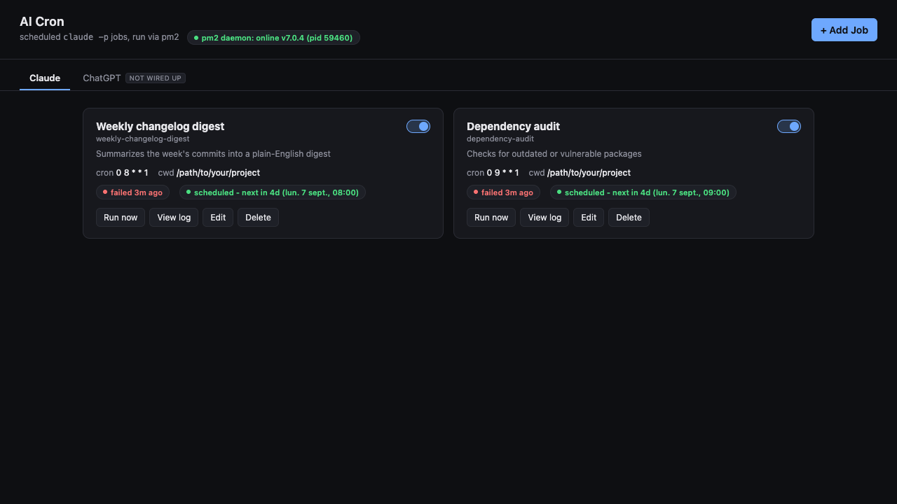

# ai-cron

Scheduled AI jobs (Claude, ChatGPT) run via [pm2](https://pm2.keymetrics.io/), with a
dashboard and a small watchdog that survives the pm2 daemon going down.

Built after a cron-automation tool dropped support for shelling out to an AI CLI on a
schedule (a deliberate, reasonable security call on their part - a "no API calls" tool
quietly calling out to one was a real trust gap). This replaces that one narrow feature
with something small, dependency-free, and easy to reason about.



## How it's laid out

- **`manifest.json`** - the list of jobs: schedule (5-field cron), prompt, context files
  to inline, where to write the output. Not committed (see Setup) - copy
  `manifest.example.json` to get started.
- **`runner.js`** - executes one job: inlines `context_files` into the prompt, calls the
  job's provider (`EXECUTORS` map), writes the result per the job's `output.mode`
  (`none` / `append_log` / `overwrite_file`, the latter keeping a `.bak`), logs the full
  run to `logs/`. An optional per-job `model` is passed through to whichever provider
  runs it.
  - `claude` shells out to `claude -p --restricted --output-format json`.
  - `chatgpt` tries the [Codex CLI](https://learn.chatgpt.com/docs/auth?surface=app)
    first (`codex exec --json --sandbox read-only`) - `codex login` is an OAuth flow
    that bills against your ChatGPT Plus/Team/Enterprise plan, not a separate API key,
    which is the only option on a company seat where API-key issuance is locked down.
    If Codex isn't installed, it falls back to a raw call to OpenAI's
    chat-completions API via `OPENAI_API_KEY` (no SDK, just `fetch`).
- **`server.js`** - the dashboard (`:47890`, configurable via `AI_CRON_PORT`). View jobs,
  toggle enabled, run on demand, view logs, add/edit/delete. Keeps pm2 in sync with
  `manifest.json` (jobs are scheduled as `pm2 start ... --cron-restart "<schedule>"
  --no-autorestart` processes).
- **`watchdog.js`** - a second, always-on process (`:47891`, `AI_CRON_WATCHDOG_PORT`)
  that runs *outside* pm2 entirely. The dashboard is itself pm2-managed, so it can't be
  the thing that rescues itself when pm2 is down - the watchdog can. Serves a
  status/start page (`public/start.html`) and can `pm2 resurrect` on request, with a
  verified hard-kill fallback for stopping (pm2's own `pm2 kill` has a real bug where it
  can report success while the daemon silently hangs alive - see the comments in
  `watchdog.js` for the full trace through pm2's source).
- **`public/index.html`** - the dashboard UI. One page per AI provider (`/claude`,
  `/chatgpt`) sharing the same template, filtered by a `provider` field on each job.
  A provider with no entry in `runner.js`'s `EXECUTORS` map fails clearly rather than
  silently trying to run.
- **`public/start.html`** - served by the watchdog. Checks whether the dashboard is up;
  if not, shows a Start button; once it's back, redirects there automatically.

No external dependencies - everything runs on Node's built-in `http`/`fs`/`child_process`.

## Setup

1. **Copy the manifest**: `cp manifest.example.json manifest.json`, edit it to your
   actual jobs (or use the dashboard's Add Job form once it's running).

2. **Point the machine-specific paths at your own install.** `watchdog.js` hardcodes
   absolute paths to `node` and `pm2` (`NODE_BIN`, `PM2_BIN` near the top) because
   launchd gives its agent a minimal `PATH` that can't resolve them otherwise - edit
   those two constants for your machine. `server.js` and `runner.js` just use `pm2` /
   `claude` from `PATH` and don't need this.

3. **Run the dashboard under pm2**:
   ```bash
   pm2 start server.js --name ai-cron-dashboard
   pm2 save
   ```

4. **Run the watchdog independently of pm2**, via its own launchd agent (macOS) so it
   has real `KeepAlive` and survives a `pm2 kill`:
   ```bash
   cp com.ai-cron.watchdog.plist.example ~/Library/LaunchAgents/com.ai-cron.watchdog.plist
   # edit the paths and UserName inside it for your machine/user, then:
   launchctl load ~/Library/LaunchAgents/com.ai-cron.watchdog.plist
   ```
   On Linux, run `watchdog.js` under systemd (`Restart=always`) instead.

5. **For ChatGPT jobs**, [install the Codex CLI](https://learn.chatgpt.com/docs/auth?surface=app)
   and run `codex login` (browser-based, uses your ChatGPT plan - the option for a
   company seat with no API key access). Don't have Codex or prefer pay-per-token
   billing? Set `OPENAI_API_KEY` in the environment the pm2 daemon runs under instead.
   Claude jobs use your existing `claude login` session either way - no key needed.

6. Open `http://localhost:47890` (redirects to `/claude`). Bookmark
   `http://localhost:47891` too - that one works even when the dashboard is down.

## Adding another provider's executor

Add its key to `PROVIDERS` in `server.js` (`ready: true`) and to the `EXECUTORS` map at
the top of `runner.js`'s `run()` function - a function taking `(job, prompt)` and
returning `{error, stdout, stderr}`, where `stdout` is a JSON string shaped
`{result, total_cost_usd, usage, is_error}` (see `callClaude`/`callChatGPT` for the
pattern). Everything downstream - parsing, logging, the dashboard's log viewer - stays
provider-agnostic as long as that shape holds.

## License

MIT - see [LICENSE](LICENSE).
